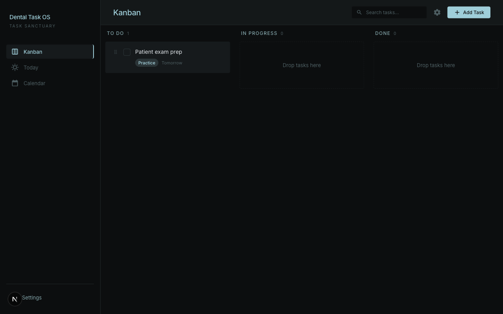

# MOLLIETASK (Dental Task OS)

Mobile-first task app for a dental practice owner: **Practice**, **Personal**, and **Family** workstreams, built with **Next.js** (App Router) and **Convex**. This repository is the working source for [github.com/sajor2000/MOLLIETASK](https://github.com/sajor2000/MOLLIETASK).



## Features (in progress)

- Kanban-style board with workstream filters and task detail
- Convex-backed tasks, reminders, and auth (`@convex-dev/auth`)
- Optional web push (VAPID) and Telegram integration (see [docs/DEVELOPMENT.md](docs/DEVELOPMENT.md))

## Quick start

```bash
npm install
npx convex dev   # in one terminal — provisions backend & prints NEXT_PUBLIC_CONVEX_URL
npm run dev      # in another — Next.js with Turbopack
```

Create `.env.local` with at least:

```bash
NEXT_PUBLIC_CONVEX_URL=https://<your-deployment>.convex.cloud
```

Full setup, optional environment variables, and deployment notes: **[docs/DEVELOPMENT.md](docs/DEVELOPMENT.md)**.

## Documentation

| Document | Description |
| --- | --- |
| [docs/dental-task-os-PRD.md](docs/dental-task-os-PRD.md) | Product requirements (Dental Task OS v1) |
| [docs/README.md](docs/README.md) | Index of plans, brainstorms, and design references |
| [design/README.md](design/README.md) | Stitch / HTML reference exports used during UI work |

## Scripts

| Command | Purpose |
| --- | --- |
| `npm run dev` | Next.js development server |
| `npm run build` | Production build |
| `npm run start` | Run production server |
| `npm run lint` | ESLint |

## License

Private project (`"private": true` in `package.json`). Adjust licensing when you are ready to publish.
