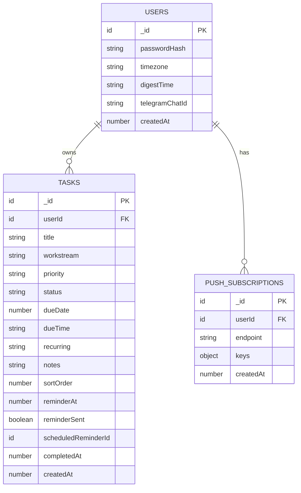

# Dental Task OS — Full Build Plan

## Overview

Build a single-user, web-first Kanban task management PWA for a dental practice owner (Mollie). Dark Scandinavian aesthetic ("Notion dark mode meets Nordic minimalism"), drag-and-drop Kanban as the default view, AI-powered natural language task capture, Telegram + web push reminders. Deployed on Vercel + Convex.

**Authoritative sources (in priority order):**
1. This plan (consolidated, canonical)
2. Brainstorm: `docs/brainstorms/2026-04-08-dental-task-os-brainstorm.md`
3. Style guide (inline in brainstorm)
4. Stitch designs (layout/component patterns only)
5. PRD `docs/dental-task-os-PRD.md` (feature logic reference — visual/auth/scope decisions overridden by brainstorm)

---

## Problem Statement

Busy dental practice owners juggle overlapping responsibilities across work and home. Generic task tools are too complex, too noisy, or weak on reminders. This app delivers: open it, see your Kanban board, drag tasks through stages, add tasks by typing naturally, trust that reminders will fire.

---

## Proposed Solution

A three-view PWA (Kanban / Today / Calendar) with:
- Drag-and-drop Kanban as the home screen
- AI chat bar for natural language task capture
- Telegram as primary notification channel, web push as secondary
- Simple password auth (no OAuth)
- Dark, calm UI following the Stitch + style guide design system

---

## Technical Approach

### Stack

| Layer | Technology | Notes |
|-------|-----------|-------|
| Framework | Next.js 15 (App Router) | `app/` router only, no `pages/` |
| Database | Convex | Real-time queries, mutations, scheduled actions, crons |
| Styling | Tailwind CSS 4 | Custom config only — no UI kit libraries |
| DnD | `@dnd-kit/core` + `@dnd-kit/sortable` | React 19 compatible, built-in keyboard a11y |
| Auth | `iron-session` | HTTP-only cookie, simple password |
| AI | Vercel AI SDK + `ai` package | Structured output via `generateText` + `Output.object()` |
| Telegram | `grammy` | Webhook on Vercel API route, `std/http` support |
| PWA | `@serwist/next` | Service worker, offline caching |
| Font | Inter (`next/font/google`) | Weights 400/500 only |
| Hosting | Vercel (hobby) | < $10/month target |
| AI Model | `gpt-4o-mini` | Cheapest structured extraction, ~$0.15/1M input tokens |

### Architecture

```
┌─────────────────────────────────────────────────┐
│  Vercel (Next.js 15 App Router)                 │
│  ┌──────────┐  ┌──────────┐  ┌───────────────┐ │
│  │ App Shell │  │ API      │  │ Telegram      │ │
│  │ (RSC +   │  │ Routes   │  │ Webhook       │ │
│  │  Client)  │  │ /api/auth│  │ /api/telegram │ │
│  └─────┬────┘  └────┬─────┘  └──────┬────────┘ │
│        │             │               │          │
│  ┌─────┴─────────────┴───────────────┴────────┐ │
│  │        Convex Client (ConvexProvider)       │ │
│  └─────────────────┬──────────────────────────┘ │
└────────────────────┼────────────────────────────┘
                     │
         ┌───────────┴───────────┐
         │       Convex          │
         │  ┌─────────────────┐  │
         │  │ Tables:         │  │
         │  │  - users        │  │
         │  │  - tasks        │  │
         │  │  - pushSubs     │  │
         │  │  - settings     │  │
         │  ├─────────────────┤  │
         │  │ Scheduled:      │  │
         │  │  - reminders    │  │
         │  │  - digest cron  │  │
         │  │  - overdue cron │  │
         │  └─────────────────┘  │
         └───────────────────────┘
```

---

## Data Model (Convex Schema)

### `users` table

```typescript
// convex/schema.ts
users: defineTable({
  passwordHash: v.string(),        // bcrypt hash, set once via seed script
  timezone: v.string(),            // e.g. "America/New_York"
  digestTime: v.optional(v.string()), // e.g. "08:00", HH:mm
  telegramChatId: v.optional(v.string()),
  telegramLinkToken: v.optional(v.string()),
  telegramLinkExpiry: v.optional(v.number()), // Unix ms
  lastUsedWorkstream: v.optional(v.string()), // "practice" | "personal" | "family"
  createdAt: v.number(),           // Unix ms
}),
```

### `tasks` table

```typescript
tasks: defineTable({
  userId: v.id("users"),
  title: v.string(),               // max 200 chars
  workstream: v.string(),          // "practice" | "personal" | "family"
  priority: v.string(),            // "high" | "normal"
  status: v.string(),              // "todo" | "inprogress" | "done"
  dueDate: v.optional(v.number()), // Unix ms, date only (midnight)
  dueTime: v.optional(v.string()), // "HH:mm" format, only if dueDate set
  recurring: v.optional(v.string()), // "daily" | "weekdays" | "weekly" | "monthly"
  notes: v.optional(v.string()),   // max 2000 chars
  sortOrder: v.number(),           // gap strategy: 1000 increments per column
  reminderAt: v.optional(v.number()), // Unix ms
  reminderSent: v.optional(v.boolean()),
  scheduledReminderId: v.optional(v.id("_scheduled_functions")),
  completedAt: v.optional(v.number()), // Unix ms
  createdAt: v.number(),           // Unix ms
})
  .index("by_userId_status", ["userId", "status"])
  .index("by_userId_dueDate", ["userId", "dueDate"])
  .index("by_userId_workstream_status", ["userId", "workstream", "status"])
  .index("by_userId_status_sortOrder", ["userId", "status", "sortOrder"]),
```

### `pushSubscriptions` table

```typescript
pushSubscriptions: defineTable({
  userId: v.id("users"),
  endpoint: v.string(),
  keys: v.object({
    p256dh: v.string(),
    auth: v.string(),
  }),
  createdAt: v.number(),
}).index("by_userId", ["userId"]),
```

### `settings` table

Not needed — settings fields live on the `users` table (single user).

### ERD



---

## Design System (Non-Negotiable)

### Color Palette

| Token | Value | Usage |
|-------|-------|-------|
| `--bg-base` | `#0f1112` | App shell, page background |
| `--surface` | `#161a1c` | Cards, columns, panels |
| `--surface-elevated` | `#1e2428` | Modals, dropdowns, bottom sheets |
| `--border` | `#252b2e` | Card borders, section dividers |
| `--text-primary` | `#e8edef` | Headings, task titles |
| `--text-secondary` | `#8fa3a8` | Metadata, dates, descriptions |
| `--text-muted` | `#4d5e62` | Placeholders, disabled states |
| `--accent` | `#7697a8` | Active states, focus rings, CTAs, column headers |
| `--accent-light` | `#a2c4c9` | Hover states, tag chips, date highlights |
| `--destructive` | `#b05050` | Overdue, delete actions |
| `--success` | `#4a8c7e` | Done status |

### Workstream Colors (adapted for dark theme)

| Workstream | Badge bg | Badge text |
|-----------|---------|-----------|
| Practice | `#7697a8` at 15% opacity | `#a2c4c9` |
| Personal | `#8fa3a8` at 15% opacity | `#8fa3a8` |
| Family | `#b05050` at 15% opacity | `#b05050` at 80% |

Each badge also includes a text label (not color-only) for accessibility.

### Rules

- No pure black or white — ever
- No shadows — depth via tonal layering only
- No decorative flourishes
- Cards: flat, 4px radius, 1px border `#252b2e`
- Kanban columns: 1px `border-left` in `#7697a8`
- Typography: Inter, 13-15px body, weight 400/500 only — **never bold**
- Spacing: 8px grid, 16-24px internal padding
- Transitions: 200ms ease-in-out
- Status pills: gray (todo), teal (in progress), green (done), red (overdue)
- Tap targets: minimum 44x44px

---

## Project Structure

```
dental-task-os/
├── app/
│   ├── layout.tsx              # Root layout, ConvexProvider, Inter font
│   ├── page.tsx                # Kanban board (default route /)
│   ├── today/
│   │   └── page.tsx            # Today view
│   ├── calendar/
│   │   └── page.tsx            # Calendar view
│   ├── login/
│   │   └── page.tsx            # Password login screen
│   ├── api/
│   │   ├── auth/
│   │   │   └── route.ts        # POST login, POST logout
│   │   ├── telegram/
│   │   │   └── route.ts        # Telegram webhook handler
│   │   └── push/
│   │       └── route.ts        # Push subscription management
│   └── sw.ts                   # Serwist service worker
├── components/
│   ├── layout/
│   │   ├── Sidebar.tsx         # Desktop left sidebar nav
│   │   ├── BottomNav.tsx       # Mobile bottom tab nav
│   │   ├── TopBar.tsx          # Top bar with search/AI input + settings gear
│   │   └── AppShell.tsx        # Responsive shell (sidebar vs bottom nav)
│   ├── kanban/
│   │   ├── KanbanBoard.tsx     # Three-column DnD board (client component)
│   │   ├── KanbanColumn.tsx    # Single column with droppable zone
│   │   └── TaskCard.tsx        # Individual task card
│   ├── task/
│   │   ├── TaskModal.tsx       # Desktop modal for create/edit
│   │   ├── TaskBottomSheet.tsx # Mobile bottom sheet for create/edit
│   │   ├── TaskForm.tsx        # Shared form fields
│   │   └── AiCaptureBar.tsx    # Natural language input bar
│   ├── today/
│   │   ├── TodayView.tsx       # Today + overdue grouped by workstream
│   │   └── WorkstreamSection.tsx # Collapsible workstream group
│   ├── calendar/
│   │   ├── CalendarGrid.tsx    # Month grid with teal dots
│   │   ├── DayAgenda.tsx       # Day's task list panel
│   │   └── CalendarNav.tsx     # Month navigation + today button
│   ├── settings/
│   │   └── SettingsPanel.tsx   # Settings modal/panel
│   └── ui/
│       ├── StatusBadge.tsx     # Status pill component
│       ├── WorkstreamBadge.tsx # Workstream label + color
│       ├── PriorityDot.tsx     # High priority indicator
│       ├── UndoToast.tsx       # 5-second undo toast
│       └── OfflineBanner.tsx   # Offline indicator
├── convex/
│   ├── schema.ts              # Table definitions
│   ├── tasks.ts               # Task CRUD mutations + queries
│   ├── users.ts               # User queries + mutations
│   ├── auth.ts                # Password validation function
│   ├── ai.ts                  # AI task parsing action
│   ├── reminders.ts           # Scheduled reminder actions
│   ├── telegram.ts            # Telegram message actions
│   ├── crons.ts               # Daily digest + overdue check
│   └── pushNotifications.ts   # Web push actions
├── lib/
│   ├── session.ts             # iron-session config + getSession helper
│   ├── constants.ts           # Workstream definitions, status enums
│   └── dates.ts               # Date utilities, recurring date calc
├── middleware.ts              # Auth middleware (redirect if no session)
├── public/
│   ├── manifest.json          # PWA manifest
│   └── icons/                 # PWA icons (192, 512)
├── tailwind.config.ts         # Custom dark theme tokens
├── next.config.ts             # Serwist plugin, Convex env
├── convex.json                # Convex project config
├── package.json
├── tsconfig.json
└── .env.local                 # APP_PASSWORD_HASH, CONVEX_URL, TELEGRAM_BOT_TOKEN, etc.
```

---

## Implementation Phases

### Phase 1: Foundation + Kanban (Core)

The goal: open the app, see a Kanban board, create tasks, drag them around.

#### 1.1 Project Scaffolding

- [ ] `npx create-next-app@latest` with TypeScript, Tailwind, App Router, ESLint
- [ ] `npx convex init` — initialize Convex project
- [ ] Install dependencies: `@dnd-kit/core`, `@dnd-kit/sortable`, `@dnd-kit/utilities`, `iron-session`, `bcryptjs`
- [ ] Configure `tailwind.config.ts` with full dark theme color palette
- [ ] Configure `next.config.ts` with Convex env vars
- [ ] Set up Inter font via `next/font/google` (weights 400, 500)
- [ ] Create `.env.local` with `CONVEX_DEPLOYMENT`, `NEXT_PUBLIC_CONVEX_URL`, `APP_PASSWORD_HASH`, `SESSION_SECRET`

**Files:** `package.json`, `tailwind.config.ts`, `next.config.ts`, `.env.local`, `convex.json`

#### 1.2 Convex Schema + Seed

- [ ] Write `convex/schema.ts` with `users`, `tasks`, `pushSubscriptions` tables
- [ ] Write seed script to create single user record with bcrypt-hashed password
- [ ] Write `convex/tasks.ts`: `addTask`, `updateTask`, `deleteTask`, `completeTask`, `uncompleteTask`, `reorderTask`, `getTasksByStatus`, `getTodayTasks`
- [ ] Write `convex/users.ts`: `getUser`, `updateSettings`
- [ ] Write `convex/auth.ts`: `validatePassword` action (bcrypt compare)
- [ ] All mutations validate `userId` argument — never trust client

**Files:** `convex/schema.ts`, `convex/tasks.ts`, `convex/users.ts`, `convex/auth.ts`

**Key decisions baked in:**
- `sortOrder` uses gap strategy (increments of 1000) for DnD reordering
- `completeTask` mutation: sets `status = "done"`, `completedAt = Date.now()`. If recurring, calls internal `spawnNextOccurrence`
- `deleteTask`: soft delete not needed in v1 — hard delete with confirmation dialog in UI
- All timestamps in Unix ms

#### 1.3 Auth (Simple Password)

- [ ] Write `lib/session.ts`: iron-session config, `getSession()` helper (async cookies in Next.js 15)
- [ ] Write `app/api/auth/route.ts`: POST handler — validate password via Convex action, set session cookie, return userId
- [ ] Write `app/login/page.tsx`: single password field, no username, submit → POST `/api/auth`
- [ ] Write `middleware.ts`: check session cookie, redirect unauthenticated to `/login`, exclude `/login` and `/api/auth`
- [ ] Rate limit: 5 attempts per minute per IP on login endpoint (simple in-memory counter, reset on success)
- [ ] Session lifetime: 30 days, rolling (activity resets expiry)

**Files:** `lib/session.ts`, `app/api/auth/route.ts`, `app/login/page.tsx`, `middleware.ts`

**Security notes:**
- `APP_PASSWORD_HASH` is a bcrypt hash stored in env var (generate via `bcryptjs.hash(password, 12)`)
- "Change password" in Settings deferred — requires env var update + redeploy. v1 shows current status only.
- iron-session cookie: `httpOnly: true`, `secure: true`, `sameSite: "lax"`
- CSRF: Convex mutations are called via the Convex client (WebSocket), not REST — inherently CSRF-safe. API routes use session validation.

#### 1.4 App Shell + Layout

- [ ] Write `app/layout.tsx`: root layout with `ConvexClientProvider` (client component), Inter font, dark `#0f1112` background
- [ ] Write `components/layout/AppShell.tsx`: responsive shell — sidebar on desktop (`>768px`), bottom nav on mobile
- [ ] Write `components/layout/Sidebar.tsx`: left sidebar with nav items (Kanban, Today, Calendar), settings gear, user avatar area
- [ ] Write `components/layout/BottomNav.tsx`: mobile bottom tab nav (Kanban / Calendar / Today icons)
- [ ] Write `components/layout/TopBar.tsx`: top bar with AI capture input + settings gear icon
- [ ] Desktop: sidebar 240px + content area (max-width 1200px centered)
- [ ] Mobile: full-width content + bottom nav 56px

**Files:** `app/layout.tsx`, `components/layout/*.tsx`

**Design notes from Stitch:**
- Sidebar bg: `#0f1112` (same as shell), nav items are text-only with accent teal for active state
- Active nav item: `border-right: 2px solid #7697a8`, bg `#161a1c`, text `#7697a8`
- Inactive: text `#4d5e62`, hover text `#8fa3a8`
- No hamburger menu on desktop — sidebar always visible
- Top bar: glassmorphism effect (`#161a1c` at 80% opacity, `backdrop-blur: 20px`)

#### 1.5 Kanban Board

- [ ] Write `components/kanban/KanbanBoard.tsx`: three-column DnD board using `@dnd-kit/core` `DndContext` + `SortableContext`
- [ ] Write `components/kanban/KanbanColumn.tsx`: droppable column with header (status name + count), 1px left border in `#7697a8`
- [ ] Write `components/kanban/TaskCard.tsx`: card with title, workstream badge, priority dot, due date
- [ ] Write `app/page.tsx`: default route `/`, renders KanbanBoard with data from `useQuery(api.tasks.getTasksByStatus)`
- [ ] Drag between columns: updates `status` field via `useMutation(api.tasks.updateTask)`
- [ ] Drag within column: updates `sortOrder` via `useMutation(api.tasks.reorderTask)`
- [ ] Optimistic updates on all mutations
- [ ] Keyboard accessibility: `@dnd-kit` provides `KeyboardSensor` — enable arrow key navigation between columns
- [ ] Empty column state: subtle dashed border drop zone with muted text "Drop tasks here"

**Files:** `app/page.tsx`, `components/kanban/*.tsx`

**Mobile Kanban:**
- Horizontal scroll with snap-to-column (`scroll-snap-type: x mandatory`)
- Each column is `min-width: 85vw` on mobile
- Column indicator dots at top showing which column is visible
- Drag-and-drop still works on touch via `@dnd-kit` `TouchSensor`

**Done column behavior:**
- Shows only tasks completed in the last 7 days
- "Show all completed" toggle at bottom with count badge
- "Clear completed" action (with confirmation dialog)

#### 1.6 Task Create/Edit

- [ ] Write `components/task/TaskForm.tsx`: shared form with all fields (title, workstream toggle, priority, status, due date, due time, recurring, notes)
- [ ] Write `components/task/TaskModal.tsx`: desktop centered modal (animated, `#1e2428` surface elevated bg)
- [ ] Write `components/task/TaskBottomSheet.tsx`: mobile bottom sheet (slide up, drag handle, swipe to dismiss)
- [ ] Floating "+" button always visible (bottom-right on desktop, above bottom nav on mobile)
- [ ] Workstream toggle: three segmented buttons (Practice / Personal / Family) — default to last used
- [ ] Priority: toggle High / Normal — default Normal
- [ ] Due date: date picker + shortcuts (Today / Tomorrow / Next Week)
- [ ] Due time: time picker, only enabled when date is set
- [ ] Recurring: dropdown (None / Daily / Weekdays / Weekly / Monthly)
- [ ] Save → Convex `addTask` or `updateTask` mutation, optimistic UI
- [ ] If `dueDate` + `dueTime` → compute `reminderAt` (same as due time in v1)
- [ ] If `dueDate` without `dueTime` → `reminderAt` = 9:00 AM on due date (user timezone)
- [ ] Delete button on edit: confirmation dialog, then hard delete

**Files:** `components/task/*.tsx`

**Task card tap behavior:**
- Tap card → opens TaskModal (desktop) or TaskBottomSheet (mobile) in edit mode
- Tap checkbox on card → complete task (animation + undo toast)

#### 1.7 Completion Flow

- [ ] Write `components/ui/UndoToast.tsx`: 5-second toast with "Undo" button
- [ ] Checkbox tap: micro-animation (check fills, card fades to 50% opacity, slides to Done column after toast expires)
- [ ] If undo clicked within 5s: restore previous status, cancel any spawned recurring instance
- [ ] If recurring: `completeTask` mutation spawns next occurrence
- [ ] Recurring date calculation rules:
  - **Daily**: next day from original due date, advance forward until future
  - **Weekdays**: next weekday from original due date, advance forward until future weekday
  - **Weekly**: +7 days from original due date, advance forward
  - **Monthly**: same day-of-month, advance forward. If day > month length, use last day of month (e.g., Jan 31 → Feb 28)
  - "Advance forward until future" means: if original due was Monday and completed Thursday, next = Friday (daily) — not Tuesday

**Files:** `components/ui/UndoToast.tsx`, logic in `convex/tasks.ts`

---

### Phase 2: AI Capture + Today + Calendar

#### 2.1 AI Task Capture

- [ ] Install `ai` package (Vercel AI SDK), `@openrouter/ai-sdk-provider`, `zod`
- [ ] Write `convex/ai.ts`: Convex action that calls Vercel AI SDK `generateText` with `Output.object()` and Zod schema
- [ ] Zod schema for parsed task:

```typescript
// convex/ai.ts
const ParsedTaskSchema = z.object({
  title: z.string().describe("Clean task title with date/time words removed"),
  dueDate: z.string().nullable().describe("ISO date string or null"),
  dueTime: z.string().nullable().describe("HH:mm format or null"),
  workstream: z.enum(["practice", "personal", "family"]).nullable()
    .describe("Infer from context: dental/clinical/admin → practice, household/kids → family, else personal"),
  priority: z.enum(["high", "normal"]).nullable()
    .describe("High if urgent language used, else normal"),
  recurring: z.enum(["daily", "weekdays", "weekly", "monthly"]).nullable()
    .describe("If recurring language like 'every day', 'each week'"),
});
```

- [ ] Write `components/task/AiCaptureBar.tsx`: input bar in TopBar, placeholder "Add a task... try natural language"
- [ ] On Enter: call Convex action, show loading spinner in input
- [ ] On success: open TaskModal/BottomSheet pre-filled with parsed fields — user confirms or edits, then saves
- [ ] On failure (AI error/timeout): use raw text as title, all other fields default, open TaskModal for manual edit
- [ ] Show subtle parsed-field preview inline before confirming (e.g., "Practice | Tomorrow 2:00 PM | High")

**Files:** `convex/ai.ts`, `components/task/AiCaptureBar.tsx`

**Cost control:**
- Model: `gpt-4o-mini` (~$0.15/1M input, $0.60/1M output)
- Average task parse: ~200 input tokens, ~100 output tokens ≈ $0.00009/task
- At 20 tasks/day = $0.054/month — well within budget

#### 2.2 Today View

- [ ] Write `app/today/page.tsx`: query `api.tasks.getTodayTasks` (due today OR overdue, status != done)
- [ ] Write `components/today/TodayView.tsx`: greeting ("Good morning, Mollie"), date, high-priority count
- [ ] Write `components/today/WorkstreamSection.tsx`: collapsible section per workstream (Practice, Personal, Family)
- [ ] Each section: list of task rows (checkbox, title, due date, priority dot)
- [ ] Overdue tasks: at top of section, subtle `#b05050` left border indicator
- [ ] Empty section: calm copy ("Nothing here. Enjoy the quiet.")
- [ ] Tap row → open edit. Tap checkbox → complete (animation + undo toast)
- [ ] Floating "+" button with due date pre-filled to today

**Files:** `app/today/page.tsx`, `components/today/*.tsx`

#### 2.3 Calendar View

- [ ] Write `app/calendar/page.tsx`: month grid + day agenda panel
- [ ] Write `components/calendar/CalendarGrid.tsx`: 7-column month grid
  - Day cells: muted date numbers (`#8fa3a8`), teal dot if day has tasks (single dot, not per-task)
  - Today cell: `#7697a8` at 20% opacity background
  - Click day → select it, agenda panel shows that day's tasks
- [ ] Write `components/calendar/CalendarNav.tsx`: month arrows + "Today" button to jump back
- [ ] Write `components/calendar/DayAgenda.tsx`: selected day's tasks
  - Desktop: right panel (280px wide, `#161a1c` bg)
  - Mobile: below the calendar grid
  - Task rows with time, title, workstream badge, completion checkbox
  - Click empty area or "+" → create task with selected date pre-filled
- [ ] Past/future month navigation: unlimited

**Files:** `app/calendar/page.tsx`, `components/calendar/*.tsx`

#### 2.4 Filters + Search

- [ ] Workstream filter on Kanban: filter chips (All / Practice / Personal / Family) above columns
- [ ] Search: the AI capture bar doubles as search when input starts with `/` or when a search icon is toggled
  - Actually, simpler: separate search icon in TopBar that expands an input. Client-side title filter across visible tasks.
- [ ] Today view: no additional filters needed (already scoped to today + overdue)
- [ ] Calendar: filter by workstream (chips above grid)

---

### Phase 3: Telegram + Reminders

#### 3.1 Telegram Bot Setup

- [ ] Create bot via BotFather, get `TELEGRAM_BOT_TOKEN`
- [ ] Write `app/api/telegram/route.ts`: webhook handler using `grammy` + `webhookCallback(bot, "std/http")`
- [ ] Validate `X-Telegram-Bot-Api-Secret-Token` header on every request
- [ ] Set webhook URL via Telegram API: `POST /setWebhook` with secret token
- [ ] Bot commands:
  - `/start {token}` → validate token, bind `telegramChatId` to user, reply "Linked!"
  - All other messages → reply "I only send reminders. Manage tasks in the app."

**Files:** `app/api/telegram/route.ts`

**Env vars:** `TELEGRAM_BOT_TOKEN`, `TELEGRAM_WEBHOOK_SECRET`

#### 3.2 Telegram Linking Flow

- [ ] In Settings, "Link Telegram" button generates a short-lived token (random 6-char alphanumeric, 10-minute expiry)
- [ ] Token stored on user record: `telegramLinkToken`, `telegramLinkExpiry`
- [ ] UI shows: "Open Telegram, find @YourBotName, send: `/start ABC123`"
- [ ] Webhook receives `/start ABC123` → Convex mutation validates token + expiry → sets `telegramChatId` → clears token
- [ ] Settings UI polls/subscribes to user record — shows "Linked" status with green badge when `telegramChatId` is set
- [ ] "Unlink" button: clears `telegramChatId`

**Files:** `convex/telegram.ts`, `convex/users.ts`, `components/settings/SettingsPanel.tsx`

#### 3.3 Reminder Scheduling

- [ ] In `convex/tasks.ts` `addTask`/`updateTask`: if `reminderAt` is set, schedule reminder:
  ```typescript
  const scheduledId = await ctx.scheduler.runAt(
    reminderAt,
    internal.reminders.sendReminder,
    { taskId }
  );
  await ctx.db.patch(taskId, { scheduledReminderId: scheduledId });
  ```
- [ ] If task updated and `reminderAt` changed: cancel old scheduled function, schedule new one
- [ ] If task completed: cancel any pending reminder
- [ ] `reminderAt` rules:
  - Due date + due time → `reminderAt` = due date at due time (user timezone)
  - Due date, no time → `reminderAt` = due date at 9:00 AM (user timezone)
  - No due date → no reminder

**Files:** `convex/tasks.ts`, `convex/reminders.ts`

#### 3.4 Reminder Delivery

- [ ] Write `convex/reminders.ts`: `sendReminder` action
  - Load task, check `reminderSent !== true` and `status !== "done"` (dedup)
  - If `telegramChatId` exists: send Telegram message via grammy/fetch:
    ```
    📋 {title}
    {workstream} · Due {formatted time}

    [Mark Done] [Snooze 1hr]
    ```
  - Send web push to all user's push subscriptions
  - Set `reminderSent = true`
- [ ] Telegram inline keyboard callbacks:
  - `done:{taskId}` → call `completeTask` mutation, reply "Done!"
  - `snooze:{taskId}` → update `reminderAt` += 1 hour, schedule new action, reset `reminderSent`, reply "Snoozed 1 hour"
  - Snooze limit: max 5 snoozes per task (prevent infinite deferral)

**Files:** `convex/reminders.ts`, `convex/telegram.ts`

#### 3.5 Daily Digest + Overdue Cron

- [ ] Write `convex/crons.ts`:
  ```typescript
  const crons = cronJobs();
  crons.interval("overdue check", { hours: 1 }, internal.reminders.checkOverdue);
  crons.interval("digest check", { minutes: 15 }, internal.reminders.checkDigest);
  export default crons;
  ```
- [ ] `checkOverdue`: runs hourly, checks if current time ≈ 9:00 AM in user timezone, queries overdue undone tasks not reminded today, sends gentle push
- [ ] `checkDigest`: runs every 15 min, checks if current time matches user's `digestTime`, sends summary:
  ```
  Good morning! Here's your day:
  📋 Practice: 3 tasks (1 high priority)
  📋 Personal: 2 tasks
  📋 Family: 1 task
  ```
- [ ] Both delivered via Telegram (if linked) + web push

**Files:** `convex/crons.ts`, `convex/reminders.ts`

#### 3.6 Web Push

- [ ] Generate VAPID keys, store in env vars
- [ ] Write `app/api/push/route.ts`: POST to save subscription, DELETE to remove
- [ ] After login, prompt user to enable push (one-time, non-blocking banner)
- [ ] If permission denied: show in-app note urging Telegram as alternative
- [ ] Push payload: `{ title: task.title, body: "${workstream} · Due ${time}", icon: "/icons/icon-192.png" }`
- [ ] Notification click: open app at `/` (Kanban board)

**Files:** `app/api/push/route.ts`, `convex/pushNotifications.ts`

**Env vars:** `VAPID_PUBLIC_KEY`, `VAPID_PRIVATE_KEY`, `VAPID_SUBJECT`

---

### Phase 4: Polish + Deploy

#### 4.1 Settings

- [ ] Write `components/settings/SettingsPanel.tsx`: modal/slide-over from gear icon
  - Timezone: dropdown, auto-filled from browser, editable
  - Daily digest: time picker (HH:mm), toggle on/off
  - Telegram: link status, link/unlink button, bot instructions
  - Push notifications: status indicator, test button
  - Danger zone: "Delete all completed tasks" (confirmation), "Delete account" (double confirmation)
- [ ] No "change password" in v1 — env var requires redeploy

**Files:** `components/settings/SettingsPanel.tsx`

#### 4.2 Loading / Error / Empty States

- [ ] Kanban loading: three skeleton columns with pulsing card placeholders
- [ ] Today empty: "Nothing due today. Enjoy the calm."
- [ ] Calendar empty day: subtle "No tasks" in agenda panel
- [ ] Error boundary: calm error page with retry button
- [ ] Network error toast: "Connection lost. Changes will sync when you're back."

#### 4.3 Offline Support (Serwist)

- [ ] Configure `@serwist/next` in `next.config.ts`
- [ ] Write `app/sw.ts` service worker:
  - Precache: app shell, fonts, icons
  - Runtime cache: Convex queries (network-first with 24hr stale fallback)
  - Today view readable offline from cache
  - Kanban view readable offline from cache
- [ ] Write `components/ui/OfflineBanner.tsx`: subtle top banner when offline ("You're offline — changes will sync when reconnected")
- [ ] Offline completions: Convex handles this natively — mutations queue and replay on reconnect

**Files:** `app/sw.ts`, `next.config.ts`, `components/ui/OfflineBanner.tsx`

#### 4.4 Animations

- [ ] Task completion: checkbox fills with `#4a8c7e`, card opacity fades to 50%, slides right after undo window
- [ ] Modal/bottom sheet: spring animation on open/close (200ms ease-out)
- [ ] DnD: smooth card pickup (slight scale 1.02, subtle border glow `#7697a8` at 30%)
- [ ] Page transitions: none (instant navigation)
- [ ] All animations respect `prefers-reduced-motion`

#### 4.5 PWA Manifest + Icons

- [ ] Write `public/manifest.json`:
  ```json
  {
    "name": "Dental Task OS",
    "short_name": "Tasks",
    "start_url": "/",
    "display": "standalone",
    "background_color": "#0f1112",
    "theme_color": "#7697a8",
    "icons": [...]
  }
  ```
- [ ] Generate icons: 192x192, 512x512 (simple teal checkmark on dark bg)
- [ ] iOS safe area insets in layout: `env(safe-area-inset-top)` etc.

#### 4.6 Vercel Deployment

- [ ] Initialize git repo, push to GitHub
- [ ] Connect to Vercel, configure environment variables:
  - `CONVEX_DEPLOYMENT`, `NEXT_PUBLIC_CONVEX_URL`
  - `APP_PASSWORD_HASH`, `SESSION_SECRET`
  - `TELEGRAM_BOT_TOKEN`, `TELEGRAM_WEBHOOK_SECRET`
  - `VAPID_PUBLIC_KEY`, `VAPID_PRIVATE_KEY`, `VAPID_SUBJECT`
  - `OPENROUTER_API_KEY`
- [ ] Deploy Convex production: `npx convex deploy`
- [ ] Set Telegram webhook URL to production domain
- [ ] Run seed script to create user record in production Convex
- [ ] Verify: login, create task, drag, AI capture, Telegram link, reminder delivery

---

## Acceptance Criteria

### Functional Requirements

- [ ] User can log in with a single password and stay logged in for 30 days
- [ ] Kanban board shows three columns (To Do, In Progress, Done) with drag-and-drop
- [ ] Tasks can be created, edited, completed, and deleted
- [ ] AI capture bar parses natural language into structured task fields
- [ ] Today view shows due-today + overdue tasks grouped by workstream
- [ ] Calendar shows month grid with task indicators and day agenda
- [ ] Telegram bot sends reminders with inline Mark Done / Snooze buttons
- [ ] Web push notifications fire for tasks with reminder times
- [ ] Daily digest sent at configured time
- [ ] Recurring tasks spawn next occurrence on completion
- [ ] Settings allow timezone, digest time, and Telegram management
- [ ] App is installable as PWA

### Non-Functional Requirements

- [ ] Kanban first paint < 100ms (Convex real-time, no loading spinner on warm cache)
- [ ] Modal/sheet open < 50ms
- [ ] WCAG 2.1 AA: keyboard DnD, non-color indicators, 44px tap targets, ARIA labels
- [ ] Offline: Today + Kanban readable, completions queue
- [ ] Cost: < $10/month (Vercel hobby + Convex free + gpt-4o-mini)
- [ ] No pure black/white, no shadows, no bold text — design system enforced

### Quality Gates

- [ ] TypeScript strict mode, no `any`
- [ ] Components ≤ 150 lines
- [ ] Convex functions single-purpose
- [ ] All mutations return created/updated IDs
- [ ] Login endpoint rate-limited (5/min/IP)
- [ ] Telegram webhook validates secret header

---

## Risk Analysis

| Risk | Likelihood | Impact | Mitigation |
|------|-----------|--------|------------|
| `@dnd-kit` touch issues on iOS Safari | Medium | High | Test early on real device in Phase 1. Fallback: status dropdown on cards for mobile. |
| AI parsing inaccuracy for workstream inference | Medium | Low | Always show confirmation before saving. User can edit. Default to "personal" if unsure. |
| Convex free tier limits | Low | High | Single user, ~100 tasks/month. Well within free tier (25K function calls/month). Monitor. |
| iOS PWA push support | Medium | Medium | Telegram is primary channel. Push is secondary. iOS 16.4+ supports web push in PWA. |
| gpt-4o-mini deprecation/pricing change | Low | Low | Vercel AI SDK makes model swap trivial (one line change). |
| iron-session + Next.js 15 async cookies | Low | Medium | Well-documented pattern. Test in Phase 1.3 early. |

---

## References

### Internal
- Brainstorm: `docs/brainstorms/2026-04-08-dental-task-os-brainstorm.md`
- PRD: `docs/dental-task-os-PRD.md`
- Stitch designs: `stitch (1)/`, `stitch (1) 2/`, `stitch (2)/`

### External
- Convex + Next.js: https://docs.convex.dev/client/react/nextjs/app-router
- @dnd-kit: https://docs.dndkit.com
- Vercel AI SDK structured output: https://sdk.vercel.ai/docs
- iron-session: https://github.com/vvo/iron-session
- grammy webhooks: https://grammy.dev/guide/deployment-types
- Serwist: https://serwist.pages.dev
