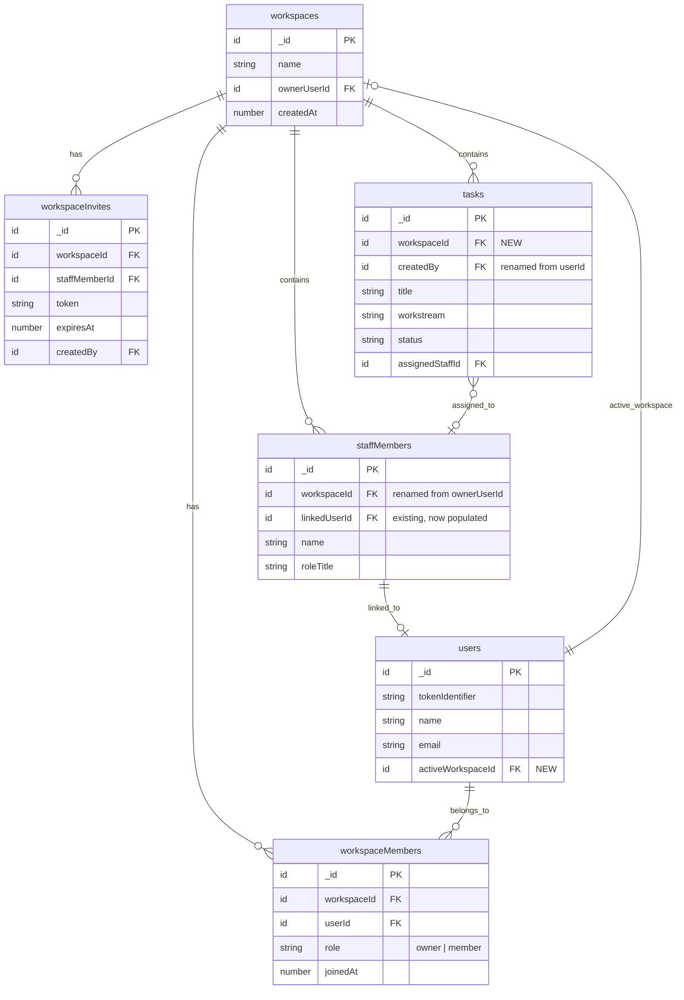

# feat: Shared Workspace Model

## Overview

Add a workspace layer to the dental task management app so staff members (Nanci, Sonal) can log in and see their assigned practice tasks. Solo users experience zero change. The workspace is created implicitly on sign-up and becomes the shared boundary when staff join via invite link.

**Scope:** Backend data model, auth layer, invite system, staff-scoped views, migration of existing data. No new framework dependencies.

## Problem Statement

Currently the app is single-user. Mollie creates tasks and assigns them to staff roster entries, but staff can't log in to see their assignments. There's no way for Nanci to check her tasks without asking Mollie. This creates friction — Mollie becomes a bottleneck for task visibility.

## Proposed Solution

Introduce a `workspaces` table as the shared ownership boundary. Every user gets one on sign-up (invisible, zero friction). Tasks, staff, templates, and attachments become workspace-scoped. Staff join via invite link, get linked to their roster entry, and see a filtered read-mostly view of their assigned practice tasks.

**Key constraints from brainstorm:**
- Staff see only assigned practice tasks (no personal/family)
- Staff can view details + update status only (Todo/InProgress/Done) + toggle subtasks
- Join via invite link (per-staff, generated from Team page)
- Workspace created implicitly on sign-up
- Single active workspace per user (v1)

---

## Technical Approach

### Architecture



### Authorization Model

Replace the current `getAuthUserId()` → `userId` pattern with a workspace-aware context:

```
convex/authHelpers.ts — new function:

getWorkspaceContext(ctx) → { userId, workspaceId, role, staffMemberId? }

  1. Get identity from ctx.auth.getUserIdentity()
  2. Look up user by tokenIdentifier
  3. Read user.activeWorkspaceId
  4. Look up workspaceMember for (userId, workspaceId)
  5. If role === "member", look up staffMember with linkedUserId === userId
  6. Return { userId, workspaceId, role, staffMemberId }

Permission helpers:
  requireOwner(ctx)  → throws if role !== "owner"
  requireMember(ctx) → throws if no workspace access
  canEditTask(ctx, task) → owner always; member never
  canUpdateTaskStatus(ctx, task) → owner always; member if assigned
  canToggleSubtask(ctx, task) → owner always; member if assigned to parent task
```

### Staff Permission Matrix

| Action | Owner | Member (assigned) | Member (not assigned) |
|--------|-------|-------------------|----------------------|
| View task list | All workstreams | Practice, assigned only | Nothing |
| View task details | Yes | Yes (assigned) | No |
| Create task | Yes | No | No |
| Edit task fields | Yes | No | No |
| Update task status | Yes | Yes | No |
| Delete task | Yes | No | No |
| Complete task | Yes | Yes | No |
| Toggle subtask | Yes | Yes | No |
| View subtasks | Yes | Yes (assigned) | No |
| Add subtask | Yes | No | No |
| View attachments | Yes | Yes (assigned) | No |
| Upload attachment | Yes | No | No |
| Use templates | Yes | No | No |
| Use AI capture | Yes | No | No |
| Manage staff | Yes | No | No |
| Manage settings | Own user settings | Own user settings | Own user settings |
| Generate invite | Yes | No | No |

---

## Implementation Phases

### Phase 1: Schema + Auth Foundation

**Goal:** Add new tables, workspace-aware auth helpers, and auto-provisioning. Existing functionality unchanged.

- [ ] **1.1 Schema: Add 3 new tables** (`convex/schema.ts`)
  ```
  workspaces: defineTable({
    name: v.string(),
    ownerUserId: v.id("users"),
    createdAt: v.number(),
  }).index("by_ownerUserId", ["ownerUserId"])

  workspaceMembers: defineTable({
    workspaceId: v.id("workspaces"),
    userId: v.id("users"),
    role: v.union(v.literal("owner"), v.literal("member")),
    joinedAt: v.number(),
  })
    .index("by_userId", ["userId"])
    .index("by_workspaceId", ["workspaceId"])
    .index("by_workspaceId_userId", ["workspaceId", "userId"])

  workspaceInvites: defineTable({
    workspaceId: v.id("workspaces"),
    staffMemberId: v.id("staffMembers"),
    token: v.string(),
    expiresAt: v.number(),
    createdBy: v.id("users"),
  })
    .index("by_token", ["token"])
    .index("by_workspaceId", ["workspaceId"])
  ```

- [ ] **1.2 Schema: Widen existing tables** (add optional `workspaceId` fields)
  - `tasks`: add `workspaceId: v.optional(v.id("workspaces"))`
  - `staffMembers`: add `workspaceId: v.optional(v.id("workspaces"))` (keep `ownerUserId` during migration)
  - `subtasks`: add `workspaceId: v.optional(v.id("workspaces"))`
  - `taskTemplates`: add `workspaceId: v.optional(v.id("workspaces"))`
  - `taskAttachments`: add `workspaceId: v.optional(v.id("workspaces"))`
  - `users`: add `activeWorkspaceId: v.optional(v.id("workspaces"))`

- [ ] **1.3 Schema: Add workspace-prefixed indexes**
  - `tasks`: `by_workspaceId_status_sortOrder`, `by_workspaceId_status_dueDate`, `by_workspaceId_assignedStaffId`
  - `staffMembers`: `by_workspaceId`, `by_workspaceId_sortOrder`, `by_linkedUserId`
  - `taskTemplates`: `by_workspaceId_category`
  - `subtasks`: no new index needed (accessed via parentTaskId)
  - `taskAttachments`: no new index needed (accessed via taskId)

- [x] **1.4 Auth: Add `getWorkspaceContext` helper** (`convex/authHelpers.ts`)
  - New function returning `{ userId, workspaceId, role, staffMemberId }`
  - Falls back to `getAuthUserId` behavior when `activeWorkspaceId` is null (migration period)
  - Add permission helper functions: `requireOwner`, `canUpdateTaskStatus`, `canToggleSubtask`

- [x] **1.5 Auth: Add shared role/permission validators** (`convex/schema.ts`)
  ```
  export const workspaceRoleValidator = v.union(v.literal("owner"), v.literal("member"));
  ```

- [x] **1.6 Auto-provision workspace in `storeUser`** (`convex/authHelpers.ts`)
  - When creating a new user, atomically create workspace + workspaceMember (role: owner)
  - Set `user.activeWorkspaceId`
  - For existing users without workspace: create on next login (checked in `storeUser`)
  - Use user's name for workspace name: `"${identity.name}'s Practice"`

- [x] **1.7 Add `getMe` workspace fields** (`convex/users.ts`)
  - Return `activeWorkspaceId` and `workspaceRole` from `getMe`

**Verification:** `npx convex dev` syncs schema. Existing app works unchanged. New users get a workspace. Existing users get a workspace on next login.

---

### Phase 2: Data Migration

**Goal:** Backfill `workspaceId` on all existing data. Use batched scheduler continuation.

- [x] **2.1 Write migration mutation** (`convex/migrations.ts` — new file)
  - `migrateUserToWorkspace` internal mutation:
    1. For each user without `activeWorkspaceId`:
       - Create workspace + workspaceMember (owner)
       - Set `user.activeWorkspaceId`
    2. Stamp `workspaceId` on up to 50 tasks per mutation (continuation pattern)
    3. Stamp `workspaceId` on staffMembers (change `ownerUserId` → workspace lookup)
    4. Stamp `workspaceId` on subtasks, taskTemplates, taskAttachments (via parent task)
  - Use `ctx.scheduler.runAfter(0, ...)` for continuation when batch limit hit

- [x] **2.2 Trigger migration** (one-time, run from Convex dashboard or CLI)
  - Schedule `migrateUserToWorkspace` for each existing user
  - Log progress

- [x] **2.3 Verify migration completeness**
  - Query for any tasks/staffMembers/templates with null `workspaceId`
  - Ensure zero results before proceeding to Phase 3

**Verification:** All existing data has `workspaceId`. App still works via legacy `userId` queries. No user-visible changes.

---

### Phase 3: Switch Queries to Workspace-Scoped

**Goal:** All queries and mutations use `workspaceId` instead of `userId` for data scoping. Permission checks enforce role-based access.

- [x] **3.1 Tasks queries** (`convex/tasks.ts`)
  - `getTasksByStatus`: Use `getWorkspaceContext`, query `by_workspaceId_status_sortOrder`
    - Owner: all tasks in workspace
    - Member: filter to `workstream === "practice"` AND `assignedStaffId.linkedUserId === userId`
  - `getTask`: Workspace membership check instead of `userId` ownership

- [x] **3.2 Tasks mutations** (`convex/tasks.ts`)
  - `addTask`: `requireOwner(ctx)`, set `workspaceId` + `createdBy`
  - `updateTask`: `requireOwner(ctx)` for field edits
  - `deleteTask`: `requireOwner(ctx)`
  - `completeTask`: Owner always; member if assigned (use `canUpdateTaskStatus`)
  - `uncompleteTask`: `requireOwner(ctx)`
  - `reorderTask`: `requireOwner(ctx)` (DnD is owner-only)
  - `deleteCompletedTasks`: `requireOwner(ctx)`
  - `insertTaskCore`: Accept `workspaceId` param, set on insert
  - `completeTaskCore`: Copy `workspaceId` to recurring clone
  - `deleteTaskCascade`: No change (already deletes by task ID)

- [x] **3.3 New mutation: `updateTaskStatus`** (`convex/tasks.ts`)
  - Minimal mutation for staff: only accepts `taskId` + `status`
  - Uses `canUpdateTaskStatus` permission check
  - Validates status is one of `todo | inprogress | done`
  - If status is `done`, delegates to `completeTaskCore` (handles recurring tasks)

- [x] **3.4 Staff queries/mutations** (`convex/staff.ts`)
  - `listStaff`: Query `by_workspaceId_sortOrder` instead of `by_ownerUserId_and_sortOrder`
  - All mutations: `requireOwner(ctx)`
  - `getStaffOwnedBy` → `getStaffInWorkspace`: Check `staffMember.workspaceId`
  - Add `linkedUserId` to staff list response (to show "Active" badge in UI)

- [x] **3.5 Subtasks** (`convex/subtasks.ts`)
  - `getSubtasks`: Check workspace membership via parent task
  - `toggleSubtask`: Use `canToggleSubtask` (owner always, member if assigned to parent)
  - `addSubtask`, `deleteSubtask`, `reorderSubtask`: `requireOwner(ctx)`

- [x] **3.6 Task Attachments** (`convex/taskAttachments.ts`)
  - `listForTask`: Workspace membership check via parent task
  - `finalizeUpload`, `removeAttachment`: `requireOwner(ctx)`
  - `generateUploadUrl`: `requireOwner(ctx)`

- [x] **3.7 Task Templates** (`convex/taskTemplates.ts`)
  - All queries/mutations: `requireOwner(ctx)`, scope by `workspaceId`
  - `createFromTemplate`: Set `workspaceId` on created task

- [x] **3.8 Internal functions** (`convex/tasks.ts`, `convex/staff.ts`)
  - `deleteCompletedTasksBatch`: Accept `workspaceId` instead of `userId`
  - `rebalanceSortOrders`: Accept `workspaceId` instead of `userId`
  - `clearStaffFromTasks`: Accept `workspaceId` instead of `userId`/`ownerUserId`

- [x] **3.9 Telegram bot** (`convex/telegramBot.ts`, `convex/http.ts`) — deferred to Phase 6 (internal functions, Telegram users are owners)
  - `getUserByChatId`: Also return `activeWorkspaceId`
  - `getTasksForTelegram`: Query by `workspaceId` instead of `userId`
  - All task mutations: Resolve workspace from user, check permissions (Telegram users are owners)
  - `addTaskFromTelegram`: Set `workspaceId` on insert

- [x] **3.10 Reminders** (`convex/reminders.ts`) — deferred to Phase 6 (internal crons, userId indexes still exist)
  - `getOverdueTasks`: Query by workspace index
  - `getDigestCounts`: Query by workspace index
  - `sendReminder`: Notify assigned staff member too (if `linkedUserId` exists with push/Telegram)
  - `checkOverdue`/`checkDigest`: Iterate workspaceMembers, not just users

- [x] **3.11 AI Actions** (`convex/aiActions.ts`) — no changes needed (uses public queries which are already workspace-scoped)
  - `parseTaskIntent`: Workspace-scoped task context
  - `suggestSubtasks`: Workspace-scoped reads

- [x] **3.12 Account deletion** (`convex/users.ts`)
  - Owner deletes account: cascade delete workspace, workspaceMembers, workspaceInvites, then all workspace data
  - Clear `linkedUserId` on any staffMembers pointing to the deleted user (if they were a member elsewhere)
  - Member deletes account: remove workspaceMember record, clear `linkedUserId` on staffMember

**Verification:** Full app works via workspace-scoped queries. All TypeScript compiles. Existing solo users see identical behavior.

---

### Phase 4: Invite System

**Goal:** Owner can generate per-staff invite links. Staff can join workspace.

- [x] **4.1 Invite generation mutation** (`convex/workspaces.ts` — new file)
  - `generateInvite`: `requireOwner(ctx)`, accepts `staffMemberId`
  - Creates `workspaceInvites` record with 7-day expiry, unique token
  - Returns token (client constructs URL)
  - Validate staff member belongs to workspace and doesn't already have `linkedUserId`

- [x] **4.2 Invite consumption** (`convex/workspaces.ts`)
  - `consumeInvite`: Called by joining user
  - Validates token exists, not expired
  - Creates `workspaceMembers` record (role: member)
  - Sets `staffMembers.linkedUserId` to joining user's ID
  - Sets joining user's `activeWorkspaceId`
  - Deletes consumed invite
  - If user had their own empty workspace, leave it (they can switch back later)

- [x] **4.3 Invite revocation** (`convex/workspaces.ts`)
  - `revokeInvite`: `requireOwner(ctx)`, deletes invite record

- [x] **4.4 List pending invites** (`convex/workspaces.ts`)
  - `listInvites`: `requireOwner(ctx)`, returns pending invites for workspace

- [x] **4.5 Invite page route** (`app/invite/[token]/route.ts` + `app/providers.tsx`)
  - Add `/invite/:token` to middleware `unauthenticatedPaths`
  - If user is logged in: consume invite, redirect to `/`
  - If not logged in: redirect to `/sign-up` with `?invite=TOKEN` param
  - After sign-up callback: consume invite token from URL param

- [x] **4.6 Remove member** (`convex/workspaces.ts`)
  - `removeMember`: `requireOwner(ctx)`, deletes workspaceMember record
  - Clears `staffMembers.linkedUserId`
  - Clears removed user's `activeWorkspaceId` (falls back to their own workspace)

**Verification:** Owner generates invite on Team page → staff clicks link → signs up → lands in workspace → sees assigned tasks.

---

### Phase 5: Staff-Scoped Frontend

**Goal:** Staff members see a filtered, permission-appropriate UI.

- [x] **5.1 Workspace context provider** (`hooks/useWorkspace.ts`)
  - Created `useWorkspace()` hook exposing `{ role, isOwner, isMember, isLoading }`
  - Reads from `getMe` (which already returns workspace info via Convex reactive query)

- [x] **5.2 Conditional navigation** (`components/layout/Sidebar.tsx`, `components/layout/BottomNav.tsx`)
  - Owner: full nav (Kanban, Today, Calendar, Team, Settings)
  - Member: filtered nav (Kanban, Today, Calendar, Settings — Team hidden)

- [x] **5.3 Kanban page — member view** (`app/page.tsx`)
  - Hide "Add Task" button, AI capture bar, Templates button for members
  - Tasks already filtered server-side (only assigned practice tasks)
  - Task cards: hide drag handle for members (no reorder)
  - Task completion checkbox: works for members (calls `completeTask`)

- [x] **5.4 Task detail — member view** (`components/task/TaskDetailView.tsx`, `components/task/TaskForm.tsx`)
  - Members see task details read-only (title, workstream, priority, due date, notes, attachments)
  - Subtask toggles: enabled for members
  - All other fields: disabled
  - No save/delete buttons, just Close
  - Used `readOnly` prop pattern

- [x] **5.5 Today/Calendar pages — member view** (`app/today/page.tsx`, `app/calendar/page.tsx`)
  - Same filtering as Kanban (server-side)
  - Hide "Add" buttons for members
  - Task completion: works

- [x] **5.6 Team page — invite UI** (`app/team/page.tsx`)
  - Add "Invite" button per staff member (only for unlinked staff)
  - Shows invite link in a copyable input
  - Shows "Active" badge on linked staff members
  - Shows "Pending invite" badge on staff with active invites
  - "Revoke invite" and "Remove member" actions for owner

- [x] **5.7 Settings page — member access** (`app/settings/page.tsx`)
  - Members can access: timezone, notification preferences, sign out
  - Members cannot access: Telegram, daily digest, account deletion
  - "Leave workspace" deferred to v2 per brainstorm

- [x] **5.8 Route guards** (client-side)
  - If member navigates to `/team`: redirect to `/`
  - If member navigates to `/settings`: show only personal settings

**Verification:** Staff member logs in → sees filtered Kanban with assigned practice tasks → can complete tasks and toggle subtasks → cannot create/edit/delete → nav shows only relevant pages.

---

### Phase 6: Tighten Schema + Cleanup

**Goal:** Remove legacy `userId`-based queries, make `workspaceId` required.

- [x] **6.1 Verify all data has `workspaceId`** — migration + verification functions in `convex/migrations.ts`
- [ ] **6.2 Make `workspaceId` required** on tasks, staffMembers, subtasks, taskTemplates, taskAttachments — deferred until migration runs on prod
- [ ] **6.3 Remove legacy `userId`-prefixed indexes** — deferred (keep for one release, then remove)
- [ ] **6.4 Rename `tasks.userId` to `tasks.createdBy`** — deferred to v2
- [ ] **6.5 Remove `staffMembers.ownerUserId`** — deferred until migration confirmed
- [x] **6.6 Clean up any dual-read fallback code** — all queries use workspace indexes; legacy indexes kept for transition

**Verification:** Schema is clean. No optional `workspaceId` fields. All queries use workspace indexes.

---

## Acceptance Criteria

### Functional Requirements

- [ ] Solo user (no staff) experiences zero change in behavior
- [ ] Workspace auto-created on sign-up (no setup step)
- [ ] Owner generates per-staff invite link from Team page
- [ ] Staff member joins via invite link (sign-up + auto-join)
- [ ] Staff member sees only assigned practice tasks
- [ ] Staff member can update task status (Todo/InProgress/Done)
- [ ] Staff member can toggle subtasks on assigned tasks
- [ ] Staff member cannot create, edit fields, delete, or reorder tasks
- [ ] Personal/family workstreams hidden from staff
- [ ] Team page shows which staff have linked accounts
- [ ] Owner can revoke invites and remove members
- [ ] Account deletion cascades workspace data correctly
- [ ] Telegram bot works with workspace context
- [ ] Reminders notify assigned staff member (if linked)
- [ ] Existing data fully migrated to workspace model

### Non-Functional Requirements

- [ ] All mutations enforce permissions server-side (never trust client)
- [ ] No regressions in existing test scenarios
- [ ] `npx tsc --noEmit` clean at every phase
- [ ] Convex schema syncs without errors
- [ ] Batch operations respect 4096 transaction limits

---

## Risk Analysis & Mitigation

| Risk | Likelihood | Impact | Mitigation |
|------|-----------|--------|------------|
| Migration misses some data | Medium | High | Verification query before Phase 6; dual-read during transition |
| Permission check missed on a mutation | Medium | High | Centralized `getWorkspaceContext` + permission helpers; code review |
| Invite link security (leaked/reused) | Low | Medium | 7-day expiry, single-use, revocable, per-staff |
| Telegram bot breaks during migration | Medium | Medium | Keep legacy `userId` fallback until Phase 6 |
| Transaction limits on large workspace migration | Low | Medium | Batched continuation pattern (already proven in codebase) |
| Staff member joins with different email than roster | Medium | Low | Per-staff invite (bypasses email matching entirely) |

---

## Files to Modify

### New Files
| File | Purpose |
|------|---------|
| `convex/workspaces.ts` | Workspace CRUD, invite generation/consumption, member management |
| `convex/migrations.ts` | One-time data migration for existing users |
| `app/invite/[token]/page.tsx` | Invite consumption route |

### Modified Files (by phase)
| File | Phase | Changes |
|------|-------|---------|
| `convex/schema.ts` | 1 | Add 3 tables, widen 5 tables, add 8+ indexes |
| `convex/authHelpers.ts` | 1 | Add `getWorkspaceContext`, permission helpers |
| `convex/users.ts` | 1, 3 | Workspace provisioning in `storeUser`, `getMe` returns workspace, cascade delete |
| `convex/tasks.ts` | 3 | All 12 functions → workspace-scoped auth, new `updateTaskStatus` |
| `convex/staff.ts` | 3 | All 8 functions → workspace-scoped, `linkedUserId` in responses |
| `convex/subtasks.ts` | 3 | All 6 functions → workspace permission checks |
| `convex/taskAttachments.ts` | 3 | All 4 functions → workspace permission checks |
| `convex/taskTemplates.ts` | 3 | All 6 functions → workspace-scoped |
| `convex/telegramBot.ts` | 3 | All internal functions → workspace context |
| `convex/http.ts` | 3, 4 | Telegram webhook workspace context, invite endpoint |
| `convex/reminders.ts` | 3 | Workspace-scoped queries, staff notifications |
| `convex/aiActions.ts` | 3 | Workspace-scoped task/staff context |
| `middleware.ts` | 4 | Add `/invite` to unauthenticated paths |
| `app/providers.tsx` | 5 | Add WorkspaceProvider context |
| `app/page.tsx` | 5 | Conditional UI for member role |
| `app/today/page.tsx` | 5 | Conditional UI for member role |
| `app/calendar/page.tsx` | 5 | Conditional UI for member role |
| `app/team/page.tsx` | 5 | Invite UI, linked status badges |
| `app/settings/page.tsx` | 5 | Member-scoped settings |
| `components/layout/Sidebar.tsx` | 5 | Conditional nav |
| `components/layout/BottomNav.tsx` | 5 | Conditional nav |
| `components/task/TaskDetailView.tsx` | 5 | Read-only mode for members |
| `components/task/TaskForm.tsx` | 5 | Disabled fields for members |

---

## Edge Cases Resolved

| Edge Case | Resolution |
|-----------|-----------|
| Staff joins with own workspace | Keeps own workspace, `activeWorkspaceId` switches to joined workspace |
| Invite clicked by existing member | Idempotent — no duplicate membership created |
| Invite expired | Show "This invite has expired" page, prompt to contact owner |
| Owner removes linked staff member | Clear `linkedUserId`, delete `workspaceMember`, member falls back to own workspace |
| Staff deletes own account | Clear `linkedUserId` on staff record, delete `workspaceMember`, tasks stay assigned to unlinked staff entry |
| Recurring task completed by staff | `completeTaskCore` clones with same `workspaceId` + `assignedStaffId` — new task appears in staff view |
| Staff searches tasks | Search scoped to assigned practice tasks only (server-side) |
| Cron digest for staff member | If staff has digest configured, send digest of their assigned tasks |

---

## References

### Internal
- Brainstorm: `docs/brainstorms/2026-04-09-shared-workspace-model-brainstorm.md`
- Backend audit: `docs/solutions/integration-issues/convex-backend-audit-auth-validation-webhooks.md`
- Auth migration: `docs/solutions/integration-issues/convex-auth-to-workos-migration-security-fixes.md`
- Batch fixes: `docs/solutions/logic-errors/convex-backend-review-batch-fixes.md`
- Convex guidelines: `convex/_generated/ai/guidelines.md`

### Key Patterns to Follow
- `completeTaskCore` / `insertTaskCore` / `deleteTaskCascade` — shared domain logic extraction
- `storeUser` atomic provisioning — gate rendering until mutation completes
- Batched cascade deletes with `ctx.scheduler.runAfter(0, ...)` continuation
- Per-staff invite tokens (similar to existing Telegram link token pattern in `users.ts`)
